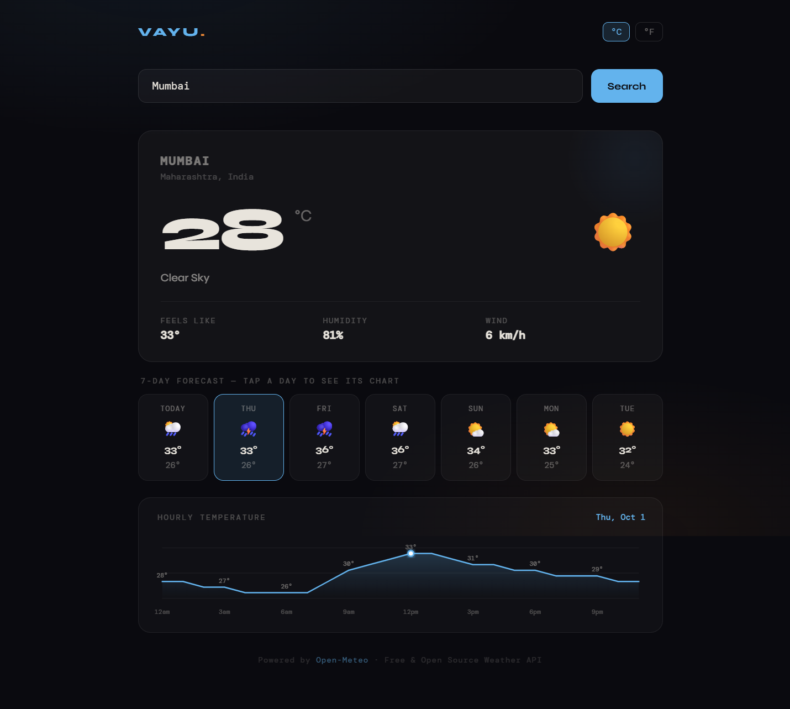

# 🌤️ VAYU Weather Dashboard

A real-time weather dashboard web app built with **React**, consuming the **Open-Meteo REST API** for live weather data. Search any city worldwide and get current conditions, a 7-day forecast, and an interactive hourly temperature chart.

**Live Demo:** https://vayu-weather.vercel.app  
**GitHub:** https://github.com/Samarth-Neema/Vayu-weather

---

## 🚀 Project Highlights

- 🌐 Fully deployed on Vercel (live production app)
- ⚡ Real-time weather data using REST APIs
- 📊 Custom-built SVG chart (no external chart libraries)
- 🔄 Dynamic UI updates using React state
- 🧠 Clean API chaining (Geocoding → Weather API)

---

## 📸 Application Preview


---

## 📸 What the App Looks Like

- Dark minimal UI with a dark theme scheme
- VAYU logo in the top left
- °C / °F toggle in the top right
- Search bar to find any city in the world
- Current weather card (temperature, feels like, humidity, wind speed(km/h))
- Clickable 7-day forecast — click any day to see its hourly temperature chart
- Hourly temperature line chart drawn with pure SVG (no chart library)
- Error handling for invalid city names

---

## 🛠️ Tech Stack

| Technology | What it's used for |
|---|---|
| **React** | UI framework — components, state, effects |
| **JavaScript (ES6+)** | Logic, API calls, data transformation |
| **CSS (in JS)** | Styling written as a JS string inside the component |
| **Open-Meteo API** | Free weather API — no API key needed |
| **SVG** | Drawing the hourly temperature line chart |
| **Vite** | Build tool — runs the local dev server |
| **Vercel** | Deployment — gives a live public URL |
| **GitHub** | Version control and source code hosting |

---

## 🔌 APIs Used

### 1. Geocoding API — converts city name to coordinates
```
GET https://geocoding-api.open-meteo.com/v1/search?name=Mumbai&count=1
```
Returns: city name, latitude, longitude, country, region

### 2. Weather Forecast API — fetches actual weather data
```
GET https://api.open-meteo.com/v1/forecast
  ?latitude=19.07&longitude=72.87
  &current=temperature_2m,apparent_temperature,relative_humidity_2m,wind_speed_10m,weather_code
  &hourly=temperature_2m
  &daily=weather_code,temperature_2m_max,temperature_2m_min
  &timezone=auto
  &forecast_days=7
```
Returns:
- `current` → right now weather conditions
- `hourly` → temperature every hour for 7 days
- `daily` → max/min temp + weather code for each of 7 days

Both APIs are completely **free**, require **no API key**, and follow the **REST** pattern (HTTP GET requests that return JSON).

---

## ⚙️ How the App Works (Flow)

```
User types city name
        ↓
geocode(city) → API call 1 → get lat/lon
        ↓
fetchWeather(lat, lon) → API call 2 → get weather JSON
        ↓
React state updates (setWeather, setLocation)
        ↓
Components re-render with new data
        ↓
User clicks a day in 7-day forecast
        ↓
setSelectedDate(date) → state updates
        ↓
HourlyChart filters hourly data for that date → re-renders
```

---

## 🧠 React Concepts Used

### `useState`
Stores data that can change — weather data, loading state, error message, selected date, unit (°C/°F)
```js
const [weather, setWeather] = useState(null);
const [selectedDate, setSelectedDate] = useState(today);
const [unit, setUnit] = useState("C");
```

### `useEffect`
Runs code when the app first loads — loads Mumbai weather by default
```js
useEffect(() => { search("Mumbai"); }, []);
```

### `useCallback`
Prevents the search function from being recreated on every render — optimization
```js
const search = useCallback(async (cityName) => { ... }, []);
```

### Component Architecture
- `WeatherApp` — main component, holds all state
- `HourlyChart` — receives data as props, draws the SVG chart

---

## 📊 How the SVG Chart Works

No chart library used — the line chart is drawn manually using SVG:

1. **Filter** hourly API data to only the selected day's 24 hours
2. **Map** each temperature value to an X,Y pixel coordinate:
   - X position = based on hour index (0–23)
   - Y position = based on temperature value (higher temp = higher on screen)
3. **Draw** a `<polyline>` connecting all 24 points
4. **Fill** the area under the line with a gradient using `<path>`
5. **Add** a glowing dot at the current hour

---

*Built by Samarth Neema — Weather data by Open-Meteo (open-meteo.com)*
